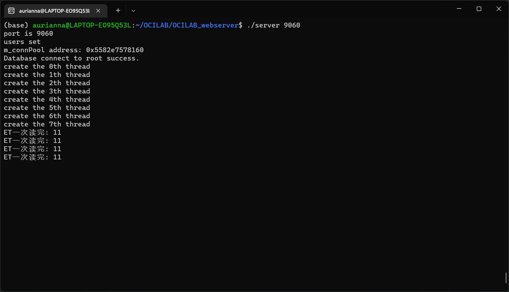
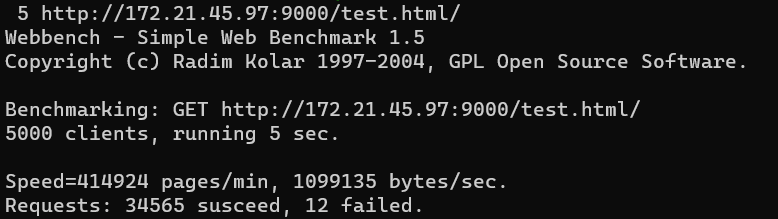
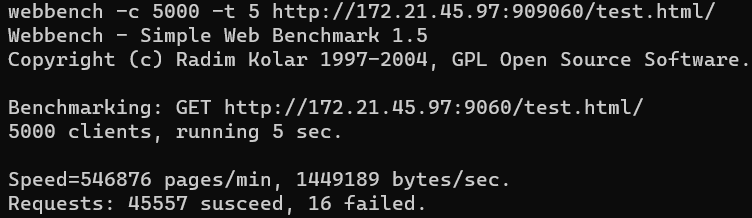

 # OCI-LAB C++ Web Server


本项目是一个基于C++20实现的Linux下高性能Web服务器。

- 采用非阻塞模拟的Proactor+线程池高并发模型，通过epoll提供高效的I/O多路复用；
- 利用mysql和数据库连接池实现用户注册登录功能；
- 结合定时器、内存池、LFU缓存，实现可用性进一步提升。

经webbench测试，**服务器可在5000并发下保持9000+QPS**。（i5-8300H+8G 使用八线程。*如果更“现代”一点的机器相信更高轻轻松松！*）


## 🌟 核心特性

### 网络核心
- **模拟的Proactor模型**  
  非阻塞IO + 边缘触发模式实现高吞吐
- **边缘触发模式**  
  双边缘触发模式
- **线程池**  
  模块化线程池（可配置线程数）

### 数据库连接
- MySQL连接池管理（支持8+并发连接）
- 用户注册登陆功能模块
- 查询结果缓存机制

### 定时器
- 双向链表实现的定时器
- 自动清理非活跃连接

### 内存池

- **三级缓存内存池**  
  ThreadCache → CentralCache → PageCache 分级管理，减少系统调用开销
- **无锁设计**  
  采用无锁队列和原子操作减少锁竟争，提高并发性能。
- **定制化内存对齐**  
  通过内存对齐和缓存行填充，减少伪共享，提高缓存命中率。


##  🔥快速开始

### 依赖环境
- Ubuntu 20 or 22.04.3 均已测试可运行
- GCC 11.4+ 或 Clang 14+ （项目使用map.contains()方法最好支持c++20如果不支持可以使用find方法）
- MySQL Server 8.0+（没有测试其他版本）
- CMake 3.12+

### 环境配置

```shell
# 检查mysql运行状态
sudo systemctl status mysql
# wsl请使用：
sudo service mysql status

# 如果你发现 MySQL 没有运行，可以尝试手动启动、重启：
sudo service mysql start
sudo service mysql restart 
```

登录并初始化数据库：

```shell
# 使用 root 用户登录 MySQL：
sudo mysql -u root -p

# 你可以选择使用 db.sql 配置数据库：
sudo mysql -u root -p < db.sql
```

> 检查数据库：
>
> ```shell
> #可以使用 netstat 或 ss 命令来检查 MySQL 是否在监听默认端口（通常是 3306）：(shell中)
> 
> sudo netstat -tuln | grep 3306
> # or
> sudo ss -tuln | grep 3306
> #应该会看到输出：tcp        0      0 127.0.0.1:3306          0.0.0.0:*               LISTEN
> ```
>
> ```mysql
> #可以使用以下mysql命令确认数据库情况：
> 
> # 查看所有数据库
> SHOW DATABASES;
> # 切换到 webserver 数据库
> USE webserver_register;
> # 查看所有表
> SHOW TABLES;
> # 查看 users 表结构
> DESC users;
> ```

#### 安装依赖

```shell
sudo apt update
sudo apt install libssl-dev          
sudo apt install libmysqlclient-dev 
# or
sudo apt install libmysqlclient-dev --fix-missing
```

> ```shell
> # 检查 MySQL 头文件是否在标准路径 /usr/include/mysql：
> ls /usr/include/mysql/mysql.h
> # 如果输出类似 /usr/include/mysql/mysql.h，说明头文件已安装
> ```

#### 配置选项

```cpp
参数	默认值	说明
#define MAX_FD 65536   // 最大的文件描述符个数
#define MAX_EVENT_NUMBER 10000  // 监听的最大的事件数量
#define MAX_SQL_NUM 8  // 数据库连接池的最大连接数
#define MAX_THREAD_NUM 8     // 线程池的最大线程数
#define MAX_REQUESTS_NUM 10000  // 线程池的最大请求数
constexpr int TIMESLOT = 5;  // 定时器的时间间隔
```

### 编译

```shell
make clean && make
make clean_objs
```

### 运行

输入任一端口号，例如9000：

```shell
./server 9000
```

然后打开浏览器输入本地ip:9000以访问。


## 📊 运行与测试

运行：



访问ip:9000：


压力测试：（i5-8300H+8G 使用八线程）

在没有定时器和内存池前，QPS大概在3000左右且无法支持大于3000的并发量。

加入定时器后：5000并发下有7000QPS



在三级缓存架构内存池加入后，性能有15%的提升：5000并发下有9000+QPS

 

 

##  🛠️压力测试

可以在linux上直接安装webbench以使用。

或者在文件夹中编译：

进入webbench文件夹，打开makefile：将CFLAGS行加入-I/usr/include/tirpc。如下：

```makefile
CFLAGS = -Wall -ggdb -W -O -I/usr/include/tirpc
```

然后构建：如果缺包就下就行了。

```shell
sudo apt install universal-ctags
make
```

然后，在文件目录下，使用：

```shell
 ./webbench -c 5000 -t 10 http://172.21.45.97:9000/
```

- -c 5000是并发量
- -t 10是压力测试时间
- 后面url不要忘记前面加http://和要以/结尾。


## 🙏 致谢

感谢qinguoyi大佬的TinyWebserver。本项目大部分内容参考于它。
